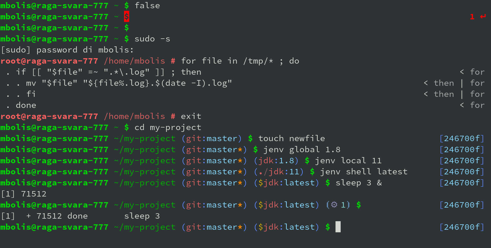

# mbolis ZSH Theme

A custom theme for [Oh my ZSH](https://github.com/ohmyzsh/ohmyzsh).

## Features

* Left prompt:
  - full path display
  - alternate prompt color for root user
  - previous command error status indicator
  - active jobs indicator
  - basic Git integration
  - [jenv](https://github.com/jenv/jenv) integration
* Right prompt:
  - actual exit code on error
  - current Git commit hash
* Second level prompt:
  - auto indentation
  - parser context stack on the right

## Screenshot



## Compatibility

* Vanilla [Oh my ZSH](https://github.com/ohmyzsh/ohmyzsh)  
```
wget -O "${ZSH}/custom/themes/mbolis.zsh-theme" \
    https://raw.github.com/mbolis/mbolis-zsh-theme/master/mbolis.zsh
```
* [Antigen](https://github.com/zsh-users/antigen)  
```
antigen use oh-my-zsh
antigen bundle git
antigen bundle jenv
antigen theme mbolis/mbolis-zsh-theme
```
* [Zgen](https://github.com/tarjoilija/zgen)  
```
zgen oh-my-zsh
zgen oh-my-zsh plugins/git
zgen oh-my-zsh plugins/jenv
zgen load mbolis/mbolis-zsh-theme
```
* [Zplugin](https://github.com/zdharma/zplugin)  
```
setopt promptsubst

zplugin ice wait lucid
zplugin snippet OMZ::lib/git.zsh

zplugin ice wait atload"unalias grv" lucid
zplugin snippet OMZ::plugins/git/git.plugin.zsh

zplugin ice wait lucid
zplugin snippet OMZ::plugins/jenv/jenv.plugin.zsh

PS1=">>> "
zplugin ice wait'!' lucid
zplugin light mbolis/mbolis-zsh-theme
```

## Future plans

* Syntax highlighting
* Auto-completion styling
* Custom behavior on double-return (?)
